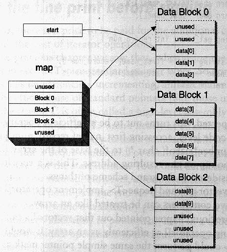

1. Container class templates:

        Sequence containers:
            array(c++11)
            vector
            deque
            list(双向链表)
            forward_list(c++11，单链表)

        iterators: begin, end, rbegin, rend
        const iterators: cbegin, cend, crbegin, crend
        capacity: size, max_size, empty, resize, shrink_to_fit, capacity, reverse
        element access: front, back, operator[], at
        modifiers: assign(赋初值), emplace(构造并且插入元素), insert, erase, emplace_back, push_back, pop_back, emplace_front, push_front, pop_front, clear, swap(交换两个container)

        Container adaptors:
            stack
            queue
            priority_queue
        Associative containers:
            set
            multiset
            map
            multimap
        Unordered associative containers:(c++11)
            unordered_set
            unordered_multiset
            unordered_map
            unordered_multimap

2. Algorithm:

    一般参数为FirstIterator, LastIterator, value(or func)

    或者FirstIterator1, LastIterator1, FirstIterator2, LastIterator2

        std::make_heap(v.begin(), v.end());
        std::pop_heap(v.begin(), v.end()); v.pop_back();//相当于先做Percate down, 将最值移到尾部，然后就可以pop出来
        v.push_back(99); std::push_heap(v.begin(), v.end());//先在尾部插入数据，然后做Percate up，重构堆
        std::sort_heap(v.begin(), v.end());//将目前的堆排序

    std::sort:

    必须保证a < b和b < a不能同时为true

    (a, b) 返回true，表示a排在b的前面
    
## STL实现

1. vector总是不释放内存，使用vector<T>(s.begin(), s.end(), swap(s));，用s创建一个临时的向量，再和s交换，这时s原先占有的空间已属于临时对象，该语句执行后临时对象会被析构；  
2. deque内存块不再被使用时会释放，内存可缩减  
3. list，set，multiset，map，multimap总是释放内存

### deque

分段数组，如下图：

除了维护分段数组，还要维护索引数组，可以随机访问，但是效率比vector要低；两端加入新元素，如果一端未满，则直接加入，如果一端已满，则创建新的分段数组，都不需要移动数组，所以效率高；但是删除中间的元素效率就比较低；内存有时候会释放。

### vector

reserve(n): 若向量容量大于等于n什么也不做，否则扩容到n，用于即将存放大数据；注意！迭代器会改变

resize(n), resize(n, val): 如果n比现有size要小，则缩减移除多余的，否则，用val来填充，若val没指定就value-initialized

容量不足的时候，创建更大的连续空间1.5-2倍，使用operator=来复制，然后删除释放原来的空间

### map

RB Tree

### set

RB Tree, unordered_set: hashset