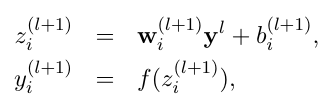
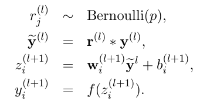
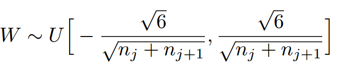

## 评测好坏

1. 速度效率
2. 内存需求
3. 效果如何

## 梯度下降优化算法

学习率η决定达到最小值或者局部最小值过程中所采用的步长的大小

### 梯度下降法的变形形式

#### 批梯度下降(batch gradient descent)

在**整个训练数据集**上计算loss关于参数θ的梯度

    θ=θ−η⋅∇θJ(θ)

1. 速度慢
2. 需要将全部的数据集倒入内存中，对内存大小要求较高；每次更新一个参数会对相似的样本计算梯度，计算过程会有冗余
3. 无法在线更新模型，即运行时无法增加新的样本
4. 对于凸函数，可以收敛到全局最小；对于非凸函数，收敛到一个局部最小值

#### 随机梯度下降(stochastic gradient descent, SGD)

根据每一条训练样本x(i)和标签y(i)更新参数

    θ=θ−η⋅∇θJ(θ;x(i);y(i))

1. 速度快
2. 内存需求小；每次更新只执行一次，消除了计算冗余
3. 可以用于在线学习
4. SGD以高方差频繁地更新，导致目标函数出现剧烈波动；如果结果是局部最优：一方面，SGD可能跳到新的或潜在的更好的局部最优；另一方面，收敛过程会变得复杂，然而已经证明当**缓慢减小学习率**，SGD和批梯度下降具有相同的收敛行为，对于非凸和凸分别收敛到局部最小和全局最小；如果步长依然较大，就会产生振荡，在极小点附近来回跳动；SGD在**凸函数下证明是按期望严格收敛的**

#### 小批量梯度下降(也成为SGD, Minibatch SGD)

每次更新使用n个小批量训练样本，大体上和SGD类似

    θ=θ−η⋅∇θJ(θ;x(i:i+n);y(i:i+n))

1. 减少参数更新的方差，得到更加稳定的收敛结果
2. 可以使用深度学习库中矩阵优化的方法，高效求解梯度

### 梯度下降优化算法

#### 动量法

1. SGD很难通过沟壑，通常是局部最优点，这种情况下，SGD摇摆地通过陡谷的斜坡，同时沿着底部到局部最优点的路径上只是缓慢的前进
2. 动量法可以帮助SGD在相关方向上加速并抑制摇摆的方法，动量法将历史步长的更新向量的一个分量增加到当前的更新向量中

        v(t)=γv(t−1)+η∇θJ(θ)
        θ=θ−v(t)

    对于在梯度点具有相同的方向的维度，动量项增大，在梯度点处改变方向的维度，动量项减小；因此可以更快的收敛，同时减少摇摆

#### Nesterov加速梯度下降法

1. 动量法盲目的沿着斜率方向，Nesterov能给动量项增加预知方向能力，通过计算关于参数未来的近似位置的梯度，而不是关于当前的参数θ的梯度，我们可以高效的求解，对动量法的一个修正

        v(t)=γv(t−1)+η∇θJ(θ−γv(t−1))
        θ=θ−v(t)

#### Adagrad

1. 让学习率适应参数，对于出现次数少的特征，采用更大的学习率，对于出现次数多的特征，采用较小的学习率，因此**特别适合处理稀疏数据**
2. 令g(t,i)为在t时刻目标函数关于参数θi的梯度

        g(t,i)=∇θJ(θi)

    在t时刻，对每个参数θi的更新过程为：

        θ(t+1,i)=θ(t,i)−η⋅g(t,i)

    Adagrad修正了对每一个参数θi的学习率：

        θ(t+1)=θ(t)-η/sqrt(G(t)+ϵ)⋅g(t,i)

3. 优点：无需手动调整学习率；缺点：分母中累加梯度的平方，平方都为正，训练过程中累加和会持续增长，导致学习率变小，学习率无限小时，Adagrad无法取得额外的信息

#### Adadelta

可以处理Adagrad学习速率单调递减的问题，不是计算所有的梯度平方，Adadelta将计算计算历史梯度的窗口大小限制为一个固定值w；在Adadelta中，无需存储先前的w个平方梯度，而是将梯度的平方递归地表示成**所有历史梯度平方的均值**，在t时刻的均值E\[g^2](t)只取决于先前的均值和当前的梯度（分量γ类似于动量项）

    E[g^2](t)=γE[g^2](t−1)+(1−γ)g^2(t)

使用Adadelta算法，我们甚至都无需设置默认的学习率，因为更新规则中已经移除了学习率

#### RMSprop

MSprop是先前我们得到的Adadelta的第一个更新向量的特例，同样，RMSprop将学习率分解成一个平方梯度的指数衰减的平均

#### Adam(自适应矩估计)

Adam对每一个参数都计算自适应的学习率。除了像Adadelta和RMSprop一样存储一个指数衰减的历史平方梯度的平均v(t)，Adam同时还保存一个历史梯度的指数衰减均值m(t)，类似于动量

    m(t)=β1m(t−1)+(1−β1)g(t)
    v(t)=β2v(t−1)+(1−β2)g^2(t)

m(t)和v(t)分别是对梯度的一阶矩（均值）和二阶矩（非确定的方差）的估计，通过计算偏差校正的一阶矩和二阶矩估计来抵消偏差

Adam相比RMSprop，增加了**偏差校正和动量**

### 批量归一化(Batch normalization)

1. 为了便于学习，我们通常用0均值和单位方差初始化我们的参数的初始值来归一化。随着不断训练，参数得到不同的程度的更新，我们失去了这种归一化，随着网络变得**越来越深**，这种现象会降低训练速度，且放大参数变化。
2. 批量归一化在每次小批量数据反向传播之后重新对参数进行0均值单位方差标准化。通过将模型架构的一部分归一化，我们能够使用更高的学习率，更少关注初始化参数。
3. 批量归一化还充当正则化的作用，减少（有时甚至消除）Dropout的必要性。

作用：

1. 加速训练
2. 容忍更高的学习率
3. 让权重初始化更容易(relu+bn)
4. 支持更多的激活函数
5. 简化深层的网络
6. 提供了一点正则的功能
7. 可能得到更好的结果

## 激活函数

### sigmoid

1. g(z) = 1 / (1 + e^-z)
2. 值域在0-1之间，当z非常大时，g(z)趋近于1；当z非常小时，g(z)趋近于0，适合于分类，可表示概率

### ReLU

### 对比

1. sigmoid在压缩数据幅度上有优势，可以保证数据幅度不会有问题
2. sigmoid存在梯度消失问题
3. ReLU不会对数据做幅度压缩，如果数据的幅度不断扩张，那么模型的层数越深，幅度的扩张也会越厉害，最终会影响模型的表现
4. ReLU没有梯度消失问题，和xavier搭配最好

## batch size & learning rate

1. 大的batch size选大的learning rate
2. 大的batch size减少方差，同时导致更大的step
3. 估计网络允许的最小学习率和最大学习率：首先我们设置一个非常小的初始学习率，比如1e-5，然后在每个batch之后都更新网络，同时增加学习率，统计每个batch计算出的loss。最后我们可以描绘出学习的变化曲线和loss的变化曲线，从中就能够发现最好的学习率。之所以上面的方法可以work，因为小的学习率对参数更新的影响相对于大的学习率来讲是非常小的，比如第一次迭代的时候学习率是1e-5，参数进行了更新，然后进入第二次迭代，学习率变成了5e-5，参数又进行了更新，那么这一次参数的更新可以看作是在最原始的参数上进行的，而之后的学习率更大，参数的更新幅度相对于前面来讲会更大，所以都可以看作是在原始的参数上进行更新的。正是因为这个原因，学习率设置要从小变到大，而如果学习率设置反过来，从大变到小，那么loss曲线就完全没有意义了。

## 过拟合

### 防止过拟合的方法

1. l1、l2正则化
2. early stopping
3. dropout
4. soft weight sharing

## dropout

### 过程

1. 随机删除网络中一定的隐藏层神经元，输入输出神经元保持不变
2. 使用删除了隐藏节点的网络训练
3. 重复上述1和2过程

没有dropout



有dropout（伯努利分布即0-1分布，二项分布为进行n次独立实验的分布）



### 作用解释

1. 组合、取平均的作用：相当于训练了多个网络，取中和效果，有点像ensemble的方法bagging
2. 减少神经元之间的复杂共适应关系：dropout导致两个神经元不一定每次都同时出现，权重更新不再依赖固有关系的隐含节点的共同作用，防止某些特征仅仅在其他特征下才有效果
3. 性别在生物进化中的角色：性别的出现可以繁衍出适应新环境的变种，有效的阻止过拟合

### tips

1. 数据量小的时候dropout效果不好，数据量大的时候dropout效果好
2. 有了dropout，训练速度会变慢

## 参数初始化

### 误区
1. 如果权重都初始化为同一个值，网络会对称，对于梯度计算不合适
2. 如果初始化为小的随机数，会导致计算出来的梯度很小，在网络不断的反向传播过程中将极大地减少“梯度信号”

### 方法

1. pretrain
2. 常量初始化
3. 高斯分布初始化
4. positive_unitball初始化：让每一个神经元的输入的权值和为1，首先给所有权值赋值为在（0，1）之间的均匀分布，然后，每一个权值再除以它们的和即可；可以防止权值初始化过大，从而防止激活函数（sigmoid函数）进入饱和区
5. 均匀分布初始化
6. xavier初始化：目的是保持输入和输出的方差一致，**避免了所有输出值都趋向于0**；限制：激活函数是线性的，在tanh、sigmoid上是好的(靠近0的地方是线性的)，ReLU用he

	```W = tf.Variable(np.random.randn(node_in, node_out)) / np.sqrt(node_in)```
	
	

7. he initialize：假定每一层有一半的神经元被激活，另一半为0，所以，要保持variance不变，只需要在Xavier的基础上再除以2

	```W = tf.Variable(np.random.randn(node_in,node_out)) / np.sqrt(node_in/2)```
	
7. msra初始化：均值为0，方差为(2/输入的个数)的高斯分布，适合ReLU激活函数

## NN

隐藏层

    a1 = g(w10x0 + w11x1 + w12x2 + b1)
    a2 = g(w20x0 + w21x1 + w22x2 + b2)
    ...
    an = g(wn0x0 + wn1x1 + wn2x2 + bn)

## DNN

## CNN

1. conv + relu + pooling + fc

### conv

1. 权值共享：一个filter的w是确定的，用此一个filter去卷积图像的所有部分，同一个filter在图像不同位置上进行卷积时的w是不变的；因此卷积层的参数数量为filter size * filter number
2. depth: filter的个数，stride: 移动步长，zero-padding: 在外围边缘补充0
3. 参数：input, filter, strides, padding

    input: [batch, in_height, in_width, in_channels]
    filter: [filter_height, filter_width, in_channels, out_channels]
    strides: [1, 1, 1, 1]
    padding: padding的方法，"SAME"或者"VALID"
    output: 

### pooling

1. 作用：依靠局部不变性，下采样，降低维度，防止过拟合

## RNN

## LSTM

## GRU
